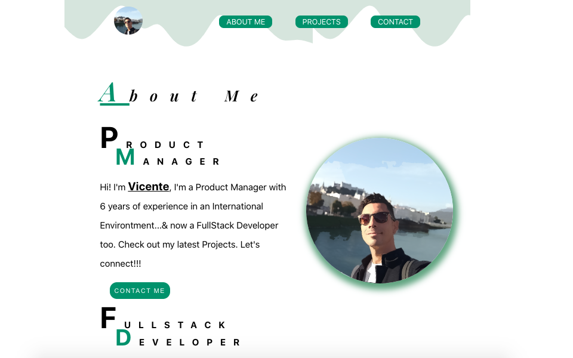

# Welcome to My Personal Page

This Project it's about my personal Website, where you can discover a little piece of me...I'm Vicente Barberá, Full Stack Developer & Product Manager.

There are 3 sections available:

- About ME
- Contact
- Portfolio

Has been developed from a minimalist & responsive vision, partially keeping in mind UX design factors.

## Getting Started - Installation

1. To deploy this project you must clone the repository through the following link:

```
https://github.com/Vincecoorp21/React-Prof-Portolio-VB
```

2. Install all npm packages.

```
npm i
```

3. Launch the project.

```
npm start

```

## Or visit online 

[My Portfolio](https://vincebc.netlify.app/)

## Preview



## Author

👤 **Vince BC**

- Twitter: [@VinceTrend](https://twitter.com/VinceTrend)
- Github: [@Vincecoorp21](https://github.com/Vincecoorp21)
- Linkedin:[@vibarcar](https://www.linkedin.com/in/vibarcar/)

This project was developed By [Vicente Barberá - Vince BC -](https://github.com/Vincecoorp21)
